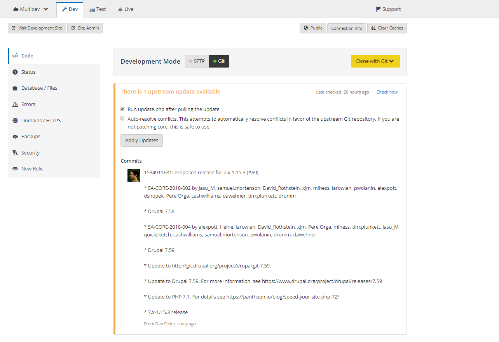

Pantheon updates
================

You can apply upstream Drupal or DKAN updates via the Site Dashboard on Pantheon as follows: 

1. Navigate to the Code tab in the Site Dashboard on the Dev environment to check available updates:

2. If you have SFTP changes you want to commit and deploy, do so now. Then set the site's connection mode to Git.
3. Select whether you want to automatically resolve conflicts. Drupal users can opt to run update.php after updates are applied.
4. Click Apply Updates.
5. Click Visit Development Site in the Development Environment to test and QA the site.
6. Follow the standard Pantheon Workflow to deploy changes up to Test and on to Live.
